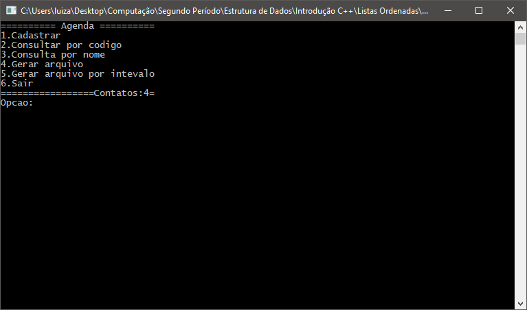

# Estrutuda de Dados: Listas Ordenadas

  Programa desenvolvido no curso de Ciência da Computação pela disciplina de Estrutura de Dados(2º Período) em C++ com o intuito de estudar a estrutura de listas ordenadas, onde cada elemento é inserido é automaticamente ordenado. Sempre que um elemento vai ser inserido na lista, a mesma é percorrida do final para o começo a fim de localizar a posição do mesmo. Trata-se de uma estrutura com um array e uma variável que guarda o valor do último elemento da lista. 
  O presente programa trata-se de uma agenda simples, que, além de oferecer opções de inserção e consulta de elementos, permite gerar arquivos por intervalo, isto é, um filtro, onde o usuário informa o caractere inicial e o final.  
  
Capturas de tela:

